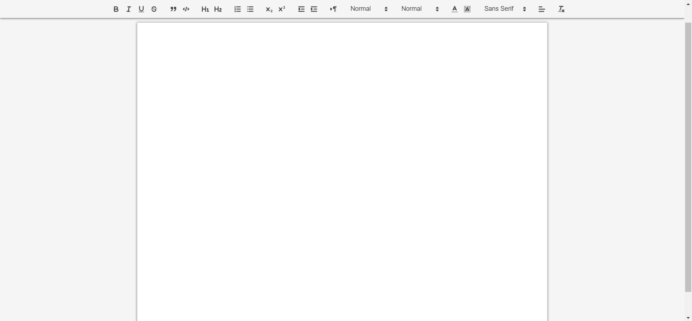

# NoteFlow

Welcome to NoteFlow - Your Collaborative Document Editing Solution!

## Overview

NoteFlow is a real-time collaborative document editing platform inspired by Google Docs. It allows users to seamlessly collaborate on text documents, fostering a productive and efficient writing experience. With NoteFlow, multiple users can simultaneously edit and view changes in real time, making it ideal for team projects, meeting notes, and more.

## Features

- **Real-time collaboration:** Edit documents simultaneously with multiple users.
- **Rich text editing:** Utilize a feature-rich text editor (e.g., Quill) for a dynamic writing experience.
- **User authentication:** Secure your documents with user accounts.
- **Document versioning:** Track and revert to previous document versions.
- **Responsive design:** Access NoteFlow seamlessly on various devices.

## Technologies Used

- **React.js:** A JavaScript library for building user interfaces, React provides the foundation for the front-end development of NoteFlow, enabling a responsive and dynamic user experience.

- **Quill.js:** A feature-rich, open-source WYSIWYG (What You See Is What You Get) text editor, Quill.js powers the text editing capabilities of NoteFlow, offering users a seamless and intuitive writing experience.

- **Socket.IO:** This library enables real-time, bidirectional, and event-based communication between clients and the server. NoteFlow leverages Socket.IO for instant collaboration, allowing multiple users to edit documents simultaneously.

- **Node.js and Express:** The server-side of NoteFlow is built using Node.js, with the Express framework providing a robust and scalable server structure. Node.js facilitates the handling of WebSocket connections through Socket.IO.

- **MongoDB:** As a NoSQL database, MongoDB is utilized for storing documents and user data in a scalable and flexible manner.

## Getting Started

### Prerequisites

Before getting started, make sure you have the following installed:

- Node.js and npm (Node Package Manager)
- MongoDB (for database storage)

### Installation

1. **Clone the repository:**

   ```bash
   git clone https://github.com/your-username/noteflow.git
2. **Navigate to the project directory, install dependencies and start the server**
   ```bash
    cd noteflow
    npm install
    npm start
Visit http://localhost:3000 in your browser to access NoteFlow.

### Contributing
We welcome contributions from the community to make NoteFlow even better! To contribute:

1. Fork the repository.
2. Create a new branch for your feature/fix: git checkout -b feature-name.
3. Make your changes and commit: git commit -m "Your descriptive commit message".
4. Push to your branch: git push origin feature-name.
Submit a pull request.



